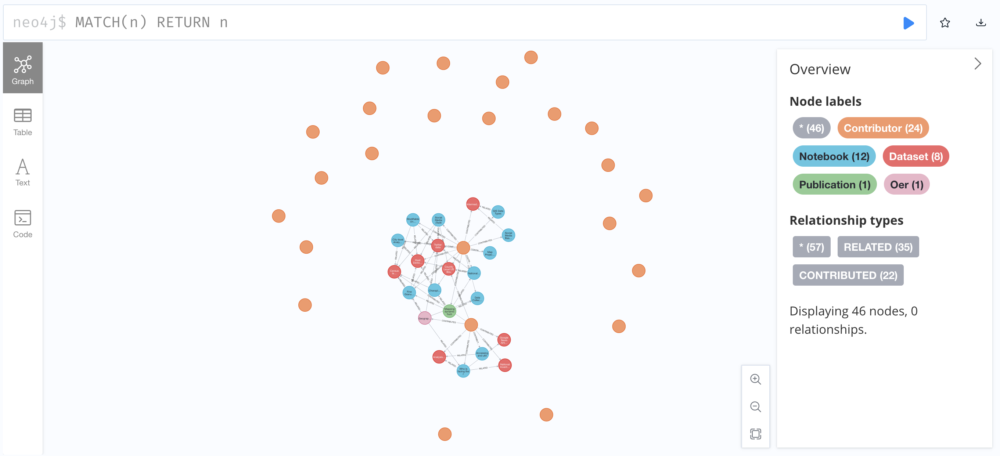

# [Outdated - Needs to be updated]
## Graph Database - Neo4j 
This directory contains scripts, settings and initial data to setup graph database (neo4j) backend for the I-GUIDE UX

## Getting Started
1. Update `docker/config.env`
    - `NEO4J_PASSWORD`: Default password for working with Neo4j DB and dashboard
    - `NEO4J_DATA_DIR`: Local directory path to persist neo4j data
    - `NEO4J_IMPORT_DIR`: Local directory path mapped to container volume from where neo4j can import data
    - `NODE_CODE_DIR`: Path for code files. Should point to `backend_scripts` directory
    - `config.env` includes other optional configurations as well
2. `cd docker && sh run.sh`
3. neo4j dashboard shoud be accessible at `http://localhost:7474/`
4. Another container `node` will also be running. Launch the container using `docker exec -it node sh`. Run following commands inside the container 
    - `node server_os_2_neo4j.test.js` (This will load sample data into neo4j with all elements and relations)
    - Confirm data is in neo4j by logging in to the neo4j dashbboard and running `MATCH(n) RETURN n` query. The sample data has 24 Contributors, 12 Notebooks, 8 Datasets, 1 Publication, 1 Open Education Resource (OER) and 57 relations i.e. 35 RELATED (e.g. Dataset RELATED Notebook etc.) and 22 CONTRIBUTED (e.g. Contributor CONTRIBUTED Dataset).

<!---
5. [Deprecared] Copy commands from `scripts/batch_insert_csv.cypher` to dashboard console to insert data
6. Copy commands from `scripts/relations.cypher` (one by one) to dashboard console to create connections
-->

## Work in Progress
- [ ] Connect neo4j to OpenSearch
  - LogStash: Create `logstash` pipeline to copy data from neo4j to OpenSearch
  - Triggers: Push data to OpenSearch whenever data is inserted into neo4j
    - Issue: Error connecting to `https` OpenSearch backend

## Directory Structure
- `data`: Contains initial data to populate the database.
- `docker`: Docker scripts to setup and launch a `neo4j` container. Please make sure to modify configurations `config.env` as mentioned above
<!---
  - `LOCAL_DATA_PATH`: To persist database upon restarts
  - `LOCAL_IMPORT_PATH`: Should point to `data` directory containing initial data to batch load into the database
  - `LOCAL_CONF_PATH`: To modify neo4j configurations
-->
- [**Deprecated**] `scripts`
  - `batch_insert_csv.cypher`: To load data into database. Can be copied directly to neo4j web console
  - `insert.cypher`: Individual queries corresponding to various tasks
  - `relations.cypher`: To create relations among data inserted